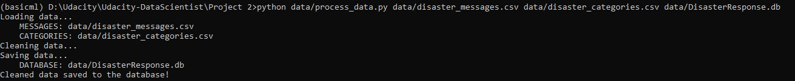
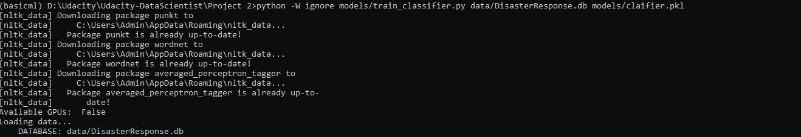
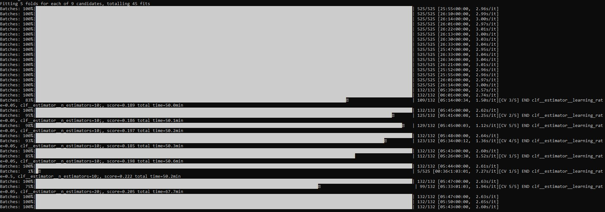
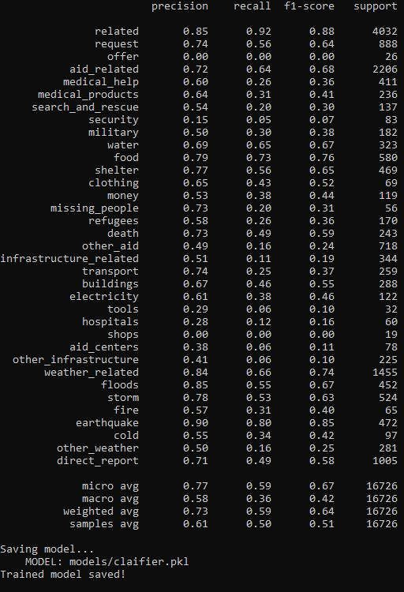
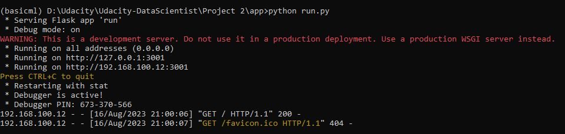
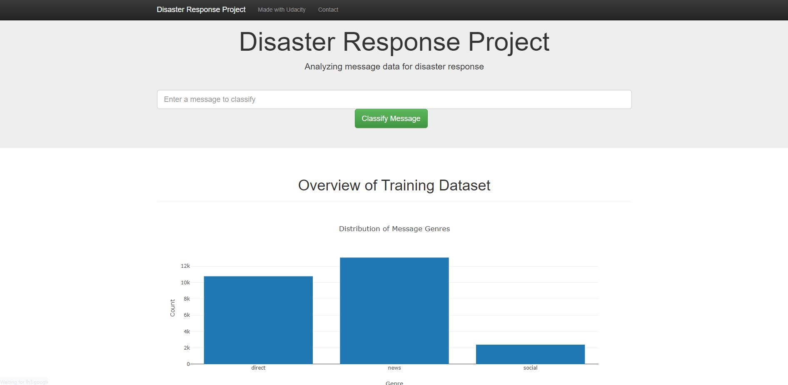
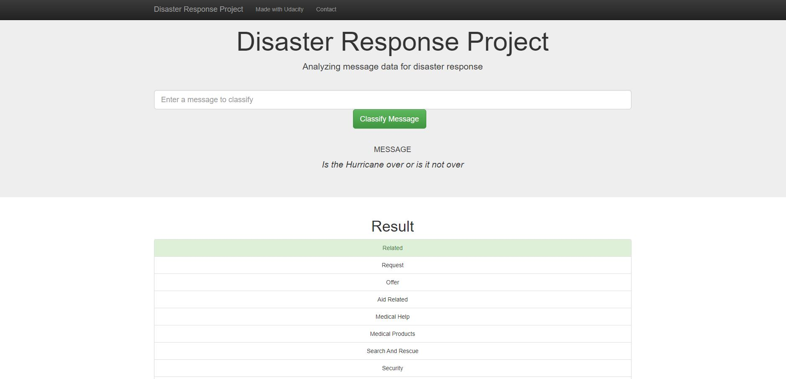
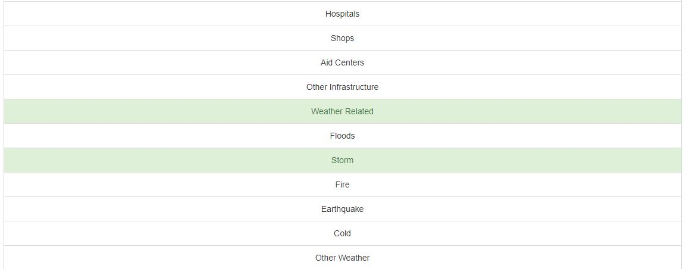

# Disaster Response Pipeline 
## Table of Contents
1. [Introduction](https://github.com/Faisal-Alageel/Udacity-DataScientist/tree/main/Project%202#introduction)
2. [File Descriptions](https://github.com/Faisal-Alageel/Udacity-DataScientist/tree/main/Project%202#file-descriptions)
3. [Installation](https://github.com/Faisal-Alageel/Udacity-DataScientist/tree/main/Project%202#installation)
4. [Instructions](https://github.com/Faisal-Alageel/Udacity-DataScientist/tree/main/Project%202#instructions)
5. [Acknowledgements](https://github.com/Faisal-Alageel/Udacity-DataScientist/tree/main/Project%202#acknowledgements)
6. [Screenshots](https://github.com/Faisal-Alageel/Udacity-DataScientist/tree/main/Project%202#screenshots)

## Introduction
This project is part of the Udacity's Data Scientist Nanodegree Program 

In this project, the pre-annotated messages related to disasters will serve as the foundation for constructing a model dedicated to disaster response. This model will possess the capability to classify incoming messages promptly during a disaster situation, ensuring their appropriate routing to the respective disaster response agencies.

This initiative encompasses a web-based application through which disaster response personnel can input received messages and obtain classification outcomes.

Disclaimer: This project is about building a proper ml pipleline using Sklearn mainly, and model performance such as (accuarcy) isnt considered, 
            to acheive highest accuracy for classification, one can use deep learning (RNNs/Transformers) 

## File Descriptions
### Folder: app
**run.py** is a Python script designed to initiate the web application. 
Directory: templates - Contains essential web assets (go.html & master.html) necessary for the proper functioning of the web application.

### Directory: data
**disaster_messages.csv** - Actual messages dispatched during disaster occurrences (supplied by Appen) 
**process_data.py** - ETL pipeline employed for data loading, cleansing, feature extraction, and database storage 
**DisasterResponse.db** - Cleaned data stored within an SQLite database
**disaster_categories.csv** - Message categories 

### Directory: models
**train_classifier.py** - This script establishes an ML pipeline for loading preprocessed data, training a model, and storing the trained model as a pickle file (.pkl) for future reference.
**classifier.pkl** - The pickle file that encompasses the trained model. (not included in this repo)

## Installation
- pandas : Data manipulation and analysis library.
- nltk: Natural Language Toolkit for NLP-related tasks.
- sklearn (scikit-learn): Machine learning library for various algorithms and tools.
- sqlalchemy: SQL toolkit and Object-Relational Mapping (ORM) library.
- sentence_transformers: Library for transforming sentences into numerical representations.
- torch: PyTorch, a deep learning framework.

## Instructions

Follow these steps in the main project directory to configure your database and model:

1. Execute the commands below to initiate the ETL pipeline, which involves data cleansing and storage in the database:
    `python data/process_data.py data/disaster_messages.csv data/disaster_categories.csv data/DisasterResponse.db`

2. Subsequently, execute the command to establish the ML pipeline, which includes training the classifier and saving it:
    `python models/train_classifier.py data/DisasterResponse.db models/classifier.pkl`

3. To launch the web application, run the following command:
    `python app/run.py`

4. Open your web browser and visit http://0.0.0.0:3001/ to access the web app.

## Acknowledgements
* [appen](https://appen.com/) for furnishing the dataset used to train our model.

## Screenshots
1. Execute the `process_data.py` script to initiate the ETL pipeline. 
    you can use `python data/process_data.py data/disaster_messages.csv data/disaster_categories.csv data/DisasterResponse.db`

2. Execute the `train_classifier.py` script to trigger the ML pipeline. 
    you can use `python models/train_classifier.py data/DisasterResponse.db models/classifier.pkl`

3. Navigate to the app's directory and execute the `run.py` script to launch the web application. 

4. The main page displays an overview of the training dataset and the distribution of message categories.  

5. Input a message and then click the 'Classify Message' button. 

6. Upon clicking 'Classify Message', the category(ies) to which the message has been classified will be displayed, highlighted in green. 

